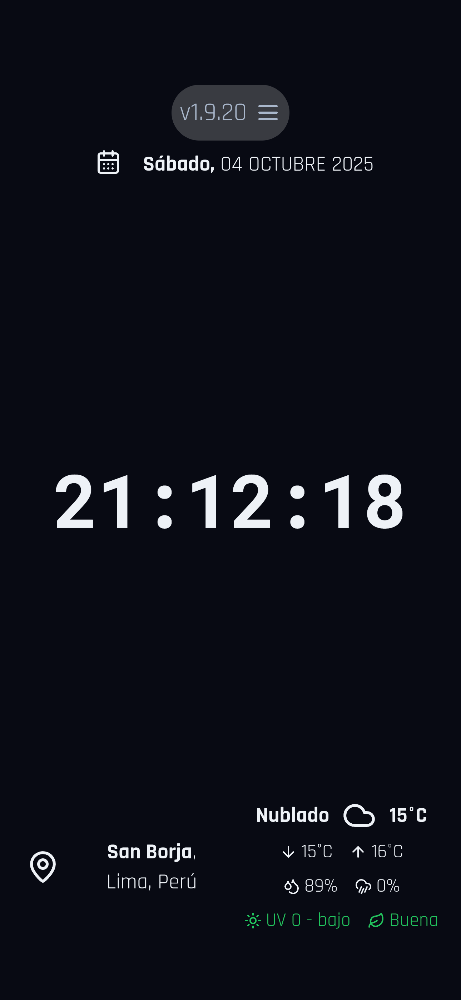
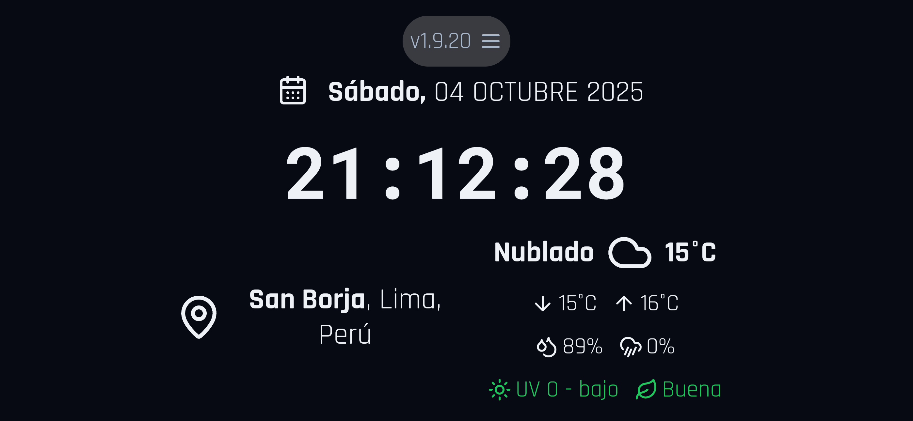
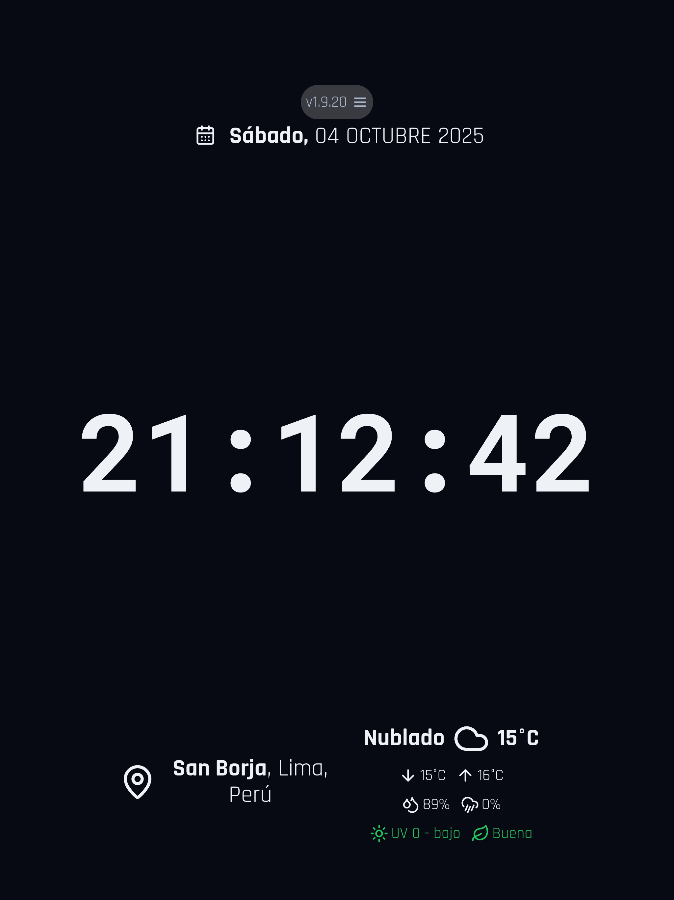
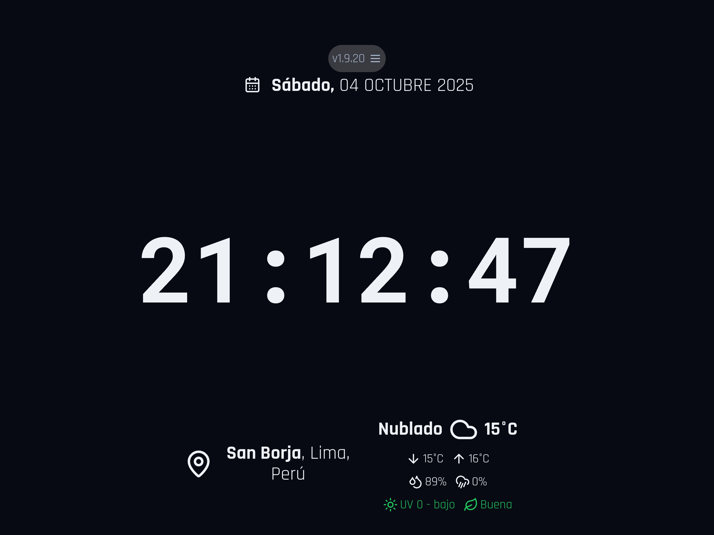
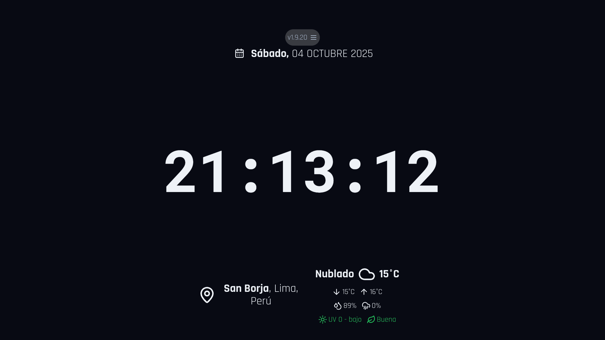

# Dashboard web: Time, Date, Location and Weather

[](https://github.com/diegoiprg/dilware-tool-webAhora/actions/workflows/deploy-gh-pages.yml)
[](https://github.com/diegoiprg/dilware-tool-webAhora/actions)
[](https://www.gnu.org/licenses/gpl-3.0)
[](./package.json)
[](https://nodejs.org/)
[](https://nextjs.org/)
[](https://www.typescriptlang.org/)
[](https://tailwindcss.com/)
[](https://github.com/diegoiprg/dilware-tool-webAhora)
[](https://github.com/diegoiprg/dilware-tool-webAhora)
[](https://github.com/diegoiprg/dilware-tool-webAhora)
[](https://github.com/diegoiprg/dilware-tool-webAhora/issues)
[](https://github.com/diegoiprg/dilware-tool-webAhora/pulls)

Minimalist and full-screen web application developed with a vibecoding approach (AI + human guidance). Displays real-time date, time, location, and local weather, ideal for giving a second life to tablets or old devices as connected clocks, dashboards, or interactive backgrounds. Built with pure HTML, CSS, and JavaScript, without frameworks or external dependencies, prioritizing performance, stability, and cross-platform compatibility. Although it works correctly in most modern browsers, it is especially optimized for the Apple ecosystem (iOS, iPadOS, and macOS), with a smooth experience in Safari and WebKit thanks to its adapted rendering and efficient resource management. Experimental project to explore how AI can accelerate development without losing human control or technical quality, improving abstraction, design, and communication skills during the process.

[**Live Demo**](https://diegoiprg.github.io/dilware-tool-webAhora/)

## Key Features

- **Real-time Clock**: Displays the current time with a customizable 12/24-hour format and an option to show/hide seconds.
- **Date Display**: Shows the current day of the week, month, and day.
- **Geolocation**: Automatically detects and displays the user's city and country.
- **Live Weather**: Provides real-time weather information, including temperature and a descriptive icon for the current conditions.
- **Fullscreen Mode**: Click on the time to enter an immersive, distraction-free fullscreen view with automatic screen wake lock to prevent sleep.
- **Screen Wake Lock**: Keeps the screen awake during fullscreen mode (compatibility varies by device and OS).
- **Customizable Settings**: A settings panel allows users to toggle features like the clock format and seconds display.
- **Responsive Design**: The layout adapts gracefully to different screen sizes, from mobile devices to large desktop monitors.
- **Analytics & User Insights**: Comprehensive Google Analytics 4 integration tracks user interactions, environment data (browser, OS, device), and app usage patterns for continuous improvement.
- **Automatic Update Notifications**: Smart version checking with visual indicators and notifications when new app versions are available, ensuring users stay up-to-date with the latest features.

## Usage

### Getting Started

1. **Load the Application**: Open your web browser and navigate to the dashboard URL
2. **Automatic Setup**: The application will automatically detect your location and display current weather information
3. **Optional Fullscreen**: Click on the displayed clock to enter fullscreen mode for an immersive experience with automatic screen wake lock
4. **Access Settings**: Click the settings icon (⚙️) in the top-right corner to customize the application

### Interface Overview

- **Clock Display**: Large, prominent time display in the center
- **Date Information**: Current date shown above or beside the clock
- **Location & Weather**: Real-time weather data with temperature, conditions, and additional metrics
- **Settings Panel**: Accessible via the gear icon for personalization options

### Fullscreen Mode & Screen Wake Lock

When entering fullscreen mode, the application automatically attempts to prevent screen sleep using the Screen Wake Lock API:

**✅ Compatible Devices:**

- Android tablets with Android 6.0+ (tested and working)
- Most modern desktop browsers
- Modern Android smartphones

**❌ Incompatible Devices:**

- iPhone/iOS devices (iOS restrictions prevent wake lock functionality)
- Android tablets with Android 4.x (screen may still lock, unless device is configured to stay awake while charging)

**Note**: Screen wake lock compatibility depends on device OS version and browser implementation. The feature gracefully fails on unsupported devices without affecting other functionality.

### Recommended Usage

- **Continuous Display**: Ideal for tablets, secondary monitors, or digital signage
- **Personal Dashboard**: Perfect for home office setups or personal information displays
- **Device Integration**: Works well on tablets repurposed as smart displays

## Screenshots

### iPhone (Portrait)



### iPhone (Landscape)



### iPad (Portrait)



### iPad (Landscape)



### macOS (Desktop)



_Note: Screenshots show the application running with sample data. The interface adapts responsively across different devices and orientations._

## Technologies Used

This project is built with a modern web stack:

- **Framework**: [Next.js](https://nextjs.org/) (with App Router)
- **Language**: [TypeScript](https://www.typescriptlang.org/)
- **Styling**: [Tailwind CSS](https://tailwindcss.com/)
- **UI Components**: [shadcn/ui](https://ui.shadcn.com/)
- **AI/Backend**: [Google's Genkit](https://firebase.google.com/docs/genkit) for potential backend and AI-powered features.
- **Deployment**: [GitHub Pages](https://pages.github.com/) via [GitHub Actions](https://github.com/features/actions).

## Security Features

- **Input Validation**: Comprehensive validation for all user inputs and API responses
- **Environment Variables**: Secure configuration management with `.env` files
- **API Security**: URL validation, request timeouts, and allowed domain restrictions
- **Error Handling**: Robust error boundaries and graceful failure handling
- **Data Sanitization**: Input sanitization and safe data processing
- **Analytics Privacy**: Optional Google Analytics with user privacy considerations

## Performance Optimizations

- **Lazy Loading**: Dynamic imports for components and routes
- **Memoization**: React.memo, useMemo, and useCallback for expensive operations
- **Bundle Optimization**: Tree shaking and code splitting with Next.js
- **Caching Strategies**: Intelligent caching for API responses and location data
- **Efficient Rendering**: Optimized re-renders and state management

## Dependencies

This application relies on the following external services and permissions:

- **APIs**:

  - [WeatherAPI.com](https://www.weatherapi.com/) for primary weather data (higher accuracy, rain probability, air quality)
  - [Open-Meteo API](https://open-meteo.com/) for weather data fallback (free, unlimited)
  - [IP-API](https://ipapi.co/) for IP-based location fallback
  - [BigDataCloud API](https://www.bigdatacloud.com/) for reverse geocoding

- **Permissions**:

  - Location permissions (Geolocation API) for accurate positioning

- **Minimum System Requirements**:
  - **Operating Systems**: iOS 12+, iPadOS 13+, macOS 10.14+, Android 4.4+ (with limitations)
  - **Browsers**: Safari 12+, Chrome 81+ (with limitations), Firefox 65+, Edge 79+

## Technical Limitations

While the application can run on older devices such as Android 4.4 and Chrome 81, there are some limitations:

- **Weather Data**: The weather section may not function properly on older Android versions and Chrome browsers.
- **Location Accuracy**: Location detection is less precise on older devices and browsers.

## Testing

The application has been tested on the following devices and configurations (vertical and horizontal modes):

- iPad Pro 12.9" M1 with iPadOS 26 and Safari browser
- iPhone 15 Pro Max with iOS 26 and Safari browser
- Mac Mini M1 with macOS 26 and Safari browser
- Samsung GT-P3110 tablet with Android 6.0.1 and Chrome v106.0.5249.126
- Samsung SM-T113NU tablet with Android 4.4.4 and Chrome v81.0.4044.138

## Getting Started

To run the project locally, follow these steps:

1.  **Clone the repository:**

    ```bash
    git clone https://github.com/diegoiprg/dilware-tool-webAhora.git
    cd dilware-tool-webAhora
    ```

2.  **Install dependencies:**

    ```bash
    npm install
    ```

3.  **Run the development server:**

    ```bash
    npm run dev
    ```

    Open [http://localhost:9002](http://localhost:9002) with your browser to see the result.

## Configuration

The application includes a settings panel (accessible via the gear icon in the top-right corner) where users can customize:

- **Temperature Unit**: Choose between Celsius (°C) or Fahrenheit (°F)
- **Time Format**: Select 12-hour or 24-hour clock format
- **Seconds Display**: Toggle visibility of seconds in the clock
- **Refresh Interval**: Set how often weather and location data should be updated (5-30 minutes or never)

Settings are automatically saved to your browser's local storage.

### Environment Variables

Create a `.env.local` file in the project root for custom API endpoints:

```env
# WeatherAPI.com (Primary - Higher accuracy, rain probability, air quality)
NEXT_PUBLIC_WEATHERAPI_KEY=your_weatherapi_key_here

# Open-Meteo (Fallback - Free, unlimited)
NEXT_PUBLIC_WEATHER_API_BASE=https://api.open-meteo.com/v1/forecast
```

**WeatherAPI.com Setup:**

1. Sign up at [weatherapi.com](https://www.weatherapi.com/)
2. Get your free API key (1000 calls/day)
3. Add it to your `.env.local` file
4. The app will automatically use WeatherAPI.com when available, falling back to Open-Meteo when quota is exceeded

## Data Sources

- **Weather Data**: [WeatherAPI.com](https://www.weatherapi.com/) (Primary) - High-accuracy weather API with rain probability, air quality index, and detailed forecasts (1000 free calls/day). Falls back to [Open-Meteo API](https://open-meteo.com/) (unlimited free tier) when quota exceeded
- **Geolocation**: Browser Geolocation API with fallback to IP-based location via [IP-API](https://ipapi.co/)
- **Reverse Geocoding**: [BigDataCloud API](https://www.bigdatacloud.com/) for converting coordinates to human-readable addresses

## Analytics & User Tracking

The application includes comprehensive Google Analytics 4 integration to track user behavior and environment data:

### Accessing User Device Information

To view detailed technical information about your users' devices and environment, follow these steps:

1. **Access Google Analytics 4**:

   - Go to [analytics.google.com](https://analytics.google.com)
   - Select your GA4 property (ID: G-FF81FMV5GT)

2. **Navigate to Reports**:

   - Click on "Reports" in the left sidebar
   - Go to "Tech" section → "Tech details"

3. **View Device & Environment Data**:

   - **Device Category**: Mobile, Tablet, Desktop usage breakdown
   - **Operating System**: iOS, Android, macOS, Windows, Linux distribution
   - **Browser**: Safari, Chrome, Firefox, Edge usage statistics
   - **Screen Resolution**: Most common screen sizes and pixel ratios
   - **Language**: User language preferences
   - **Country/Region**: Geographic distribution of users

4. **Custom Dimensions & Events**:

   - **Custom Events**: Track fullscreen toggles, settings changes, theme switches
   - **User Environment**: Browser version, OS version, device type, touch support
   - **App Usage**: Orientation changes, version updates, feature interactions
   - **Error Monitoring**: JavaScript errors with context and stack traces

5. **Real-time Monitoring**:

   - Go to "Reports" → "Realtime" to see live user activity
   - Monitor active users, page views, and real-time events
   - View current user locations and device types

6. **Advanced Analysis**:
   - Create custom reports combining device data with user behavior
   - Set up alerts for specific device categories or error rates
   - Use audience segmentation based on device characteristics

### Tracked Data

- **User Interactions**: Fullscreen toggles, settings changes, temperature unit changes, time format preferences
- **App Usage**: Orientation changes, device type detection, app version tracking, update notifications
- **Weather & Location**: Data loading success/failure, geolocation permissions, location accuracy
- **User Environment**: Browser name/version, operating system, device type, screen resolution, pixel ratio, touch support, language, timezone
- **Error Monitoring**: JavaScript errors with context and stack traces
- **Version Management**: Update availability checks, user update notifications, version status tracking, update check interval preferences, update applications via icon click

## Configuration Options

The app provides extensive customization options through the comprehensively organized settings panel:

### Fecha (Date Settings)

- **Separador de Fecha**: Choose between space (default), dot (.), slash (/), or dash (-) separators between day/month/year
- **Formato del Día**: Select 3-character abbreviations (default) or complete day names
- **Formato del Mes**: Select 3-character abbreviations (default) or complete month names

**Date Format Examples:**

- `Sábado, 04 OCT 2025` (day full, month short, space separator)
- `Sábado, 04.OCT.2025` (day full, month short, dot separator)
- `Sábado, 04-OCT-2025` (day full, month short, dash separator)
- `Sábado, 04/OCT/2025` (day full, month short, slash separator)
- `Sáb, 04 OCT 2025` (day abbreviated, month short, space separator)
- `Sáb, 04.OCT.2025` (day abbreviated, month short, dot separator)
- `Sáb, 04-OCT-2025` (day abbreviated, month short, dash separator)
- `Sáb, 04/OCTUBRE/2025` (day abbreviated, month full, slash separator)

### Hora (Time Settings)

- **Formato de Hora**: Choose between 24-hour (default) or 12-hour (AM/PM) format - 24h enables seconds automatically, 12h disables them to prevent text overflow
- **Mostrar Segundos**: Toggle visibility of seconds in the clock display (automatically managed based on time format)
- **Separadores Parpadeantes**: Toggle blinking effect for time separators (:) every second

### Clima (Weather Settings)

- **Unidad de Temperatura**: Choose between Celsius (°C, default) or Fahrenheit (°F) - displays unit abbreviation in temperature
- **Intervalo de Actualización**: Configure how often weather data updates (1 minute default, up to 30 minutes)

### General (General Settings)

- **Modo de Tema**: Select between dark (default) or light theme - fully functional with complete color inversion
- **Intervalo de Verificación de Actualizaciones**: Set how frequently the app checks for new versions (1 minute default, up to 12 hours)

### Data Persistence

All settings are automatically saved to localStorage and persist across browser sessions.

## Update Notifications

The application includes an intelligent update notification system that keeps users informed about new versions:

### Visual Indicators

- **🔄 Checking**: Blue spinning icon when checking for updates (positioned before version text)
- **⚠️ Update Available**: Orange warning icon when a new version is detected - **clickable** to immediately apply update
- **✅ Up to Date**: Green checkmark icon when the app is current

### Notification Features

- **Automatic Checks**: Background version checking every 30 minutes
- **Toast Notifications**: Non-intrusive popup messages when updates are available
- **GitHub Integration**: Fetches latest release information from GitHub API
- **Fallback Mechanism**: Uses local package.json as backup for version detection
- **User Control**: Users can dismiss update notifications

### How It Works

1. **Initial Check**: On app load, performs an immediate version check with robust error handling
2. **Periodic Checks**: Automatically checks for new versions at user-configurable intervals (5 minutes to 12 hours, or never)
3. **API Fallback**: If GitHub API fails, falls back to local package.json version check
4. **Timeout Protection**: 8-second timeout for API calls, 3-second timeout for fallbacks to prevent hanging
5. **Visual Feedback**: Shows appropriate icons positioned before version text (loading 🔄, update ⚠️, up-to-date ✅)
6. **One-Click Updates**: Click the orange warning icon (⚠️) to immediately reload and apply the latest version
7. **Smart Notifications**: Displays toast messages only when updates are actually available
8. **Analytics Tracking**: Records all version check interactions, interval preferences, and update applications
9. **User Control**: Complete customization of update checking frequency through settings panel

### Privacy & Compliance

- All tracking is anonymous and aggregated
- No personally identifiable information is collected
- Analytics data is used solely for improving user experience and app performance
- Users can opt-out of analytics by using browser privacy extensions

## Browser Compatibility

- Modern browsers with ES6+ support
- Geolocation API support recommended for accurate location detection
- Fullscreen API support for immersive mode
- Wake Lock API support for keeping screen active (optional)

## Troubleshooting

### Weather data not loading

- Check your internet connection
- Ensure location permissions are granted in your browser
- Try refreshing the page

### Location detection issues

- Grant location permissions when prompted
- The app will fall back to IP-based location if geolocation fails

### Screen not staying awake

- Wake Lock API may not be supported in your browser
- Consider using a different browser or device

## Contributing

Contributions are welcome! Please feel free to submit a Pull Request. For major changes, please open an issue first to discuss what you would like to change.

1. Fork the project
2. Create your feature branch (`git checkout -b feature/AmazingFeature`)
3. Commit your changes (`git commit -m 'Add some AmazingFeature'`)
4. Push to the branch (`git push origin feature/AmazingFeature`)
5. Open a Pull Request

## Changelog

For detailed version history and changes, see [CHANGELOG.md](./CHANGELOG.md).

## Author

**Diego Iparraguirre**
[](https://linkedin.com/in/diegoiprg)
[](https://github.com/diegoiprg)

## Acknowledgments

- Icons provided by [Lucide React](https://lucide.dev/)
- UI components built with [shadcn/ui](https://ui.shadcn.com/)
- Weather data courtesy of [Open-Meteo](https://open-meteo.com/)
- Font inspiration from Apple's design system

## License

This project is licensed under the **GNU General Public License v3.0**. See the [LICENSE](./LICENSE) file for details.
